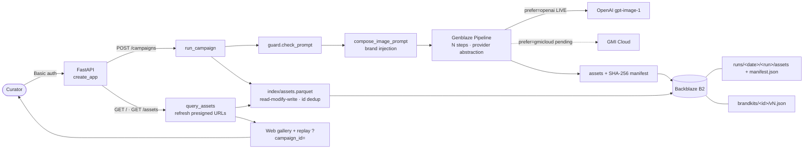

# BrandForge

> Brand-consistent SNS media generation pipeline — built on **Genblaze** and **Backblaze B2** for the Backblaze Generative Media Hackathon.

Define a **Brand Kit** once (palette, tone, style prompt fragments, target platforms). For each campaign theme, BrandForge generates a coordinated set of on-brand images, tracks every asset with a **SHA-256 provenance manifest**, versions everything in **Backblaze B2** under a hierarchical key strategy, folds it into a searchable **Parquet catalog**, and serves it through an authenticated gallery with presigned delivery URLs. (A short-video chain and per-platform captions are built into the codebase; see [Status](#status) and [AI providers and models used](#ai-providers-and-models-used) for exactly what is live vs. wired-but-not-in-the-deployed-path.)

## Live demo

- **App**: https://brandforge-ohce.onrender.com — server-rendered gallery + JSON API.
- **Auth**: every route except `/healthz` needs HTTP Basic. Test account username is `curator`; the password is shared privately with judges via the Devpost submission form (never committed to this repo).
- **Repo**: https://github.com/aomizuki0307/brandforge (public).
- Free-tier Render sleeps when idle, so the first request after a while takes a **cold start (~30–60s)** — give it a moment, then reload.

> Presigned URLs in the gallery are short-lived, signed read links to private B2 objects. Don't paste them anywhere public or record them on screen.

## Why Genblaze + B2

- **Genblaze**: one fluent `Pipeline` orchestrates multi-step generation and brand injection, abstracts the provider behind a one-line change (OpenAI live today; GMI Cloud wired for images + short video, pending free credits), and emits a verifiable **provenance manifest** per run (`manifest.verify()` re-hashes every asset).
- **Backblaze B2**: durable, versioned home for every generated asset, its manifest, and a Parquet asset index — addressed with a hierarchical key strategy (`runs/<date>/<run>/…`, `brandkits/<id>/vN.json`, `index/assets.parquet`) and delivered via presigned URLs. Not just a bucket: Brand Kit versioning, manifest-beside-assets provenance, and a queryable catalog make B2 the system of record.

See [`docs/architecture.md`](docs/architecture.md) for the full data-flow diagram and how each piece maps to the judging axes.

## Status

**Submission-ready** for the Backblaze Generative Media Hackathon. Live and tested:

- **Phase 1** — single image → B2 → **verified** SHA-256 manifest.
- **Phase 2** — multi-variant on-brand image **set**, one manifest per campaign.
- **Phase 4** — single **Parquet asset catalog** in B2, auto-updated per campaign and queryable for the gallery.
- **Phase 6** — **FastAPI + web gallery** with replay, HTTP Basic auth (fail-closed), security headers, rate limiting, and Docker/Render deploy — **deployed** (URL above).

Quality gates: **83 tests green**, coverage ~97%, `ruff` clean.

Built into the codebase but **not in the deployed demo path** (disclosed for honesty, see below): the **short-video chain** (Phase 3, activates with `prefer="gmicloud"` once GMI credits land) and **per-platform captions** (`app/captions.py`, fully guarded, not yet wired into the campaign/web flow).

## Architecture



Full narrative and judging-axis mapping: [`docs/architecture.md`](docs/architecture.md).

## Setup

```bash
python -m venv .venv
# Windows: .venv\Scripts\Activate.ps1   |   *nix: source .venv/bin/activate
pip install -r requirements.txt
cp .env.example .env   # then fill in B2 + provider keys
```

### Required accounts / keys

| Service | Purpose | Notes |
|---|---|---|
| Backblaze B2 | Asset storage (required) | Free tier 10GB. Create an Application Key. |
| OpenAI | Image generation (`gpt-image-1`) + captions (`gpt-5-mini`) | The provider the deployed app runs on. Pay-as-you-go. |
| GMI Cloud | Image + short-video provider (optional) | Wired via `prefer="gmicloud"`; pending free credits, so not active in the deployed demo. |

> At least one generative provider (`OPENAI_API_KEY` or `GMICLOUD_API_KEY`) is required; the app fails fast at startup otherwise.

## Generate a campaign

`run_campaign` is the single entry point: it saves the Brand Kit revision, runs
one Genblaze `Pipeline` of `num_variants` on-brand steps, and returns the whole
image **set** under one provenance manifest.

```python
from app.campaign import run_campaign
from app.config import load_settings
from app.models import BrandKit, Campaign

settings = load_settings()
brand = BrandKit(id="acme", name="Acme", tone_words=["clean", "bold"],
                 style_prompt="flat vector, soft gradients")
campaign = Campaign(id="launch-1", brand_kit_id="acme",
                    theme="summer product launch", num_variants=3)

result = run_campaign(settings, brand, campaign)   # OpenAI-first; prefer="gmicloud" once credits land
# result.brand_kit_url, result.assets (all share result.manifest), result.run
```

Each run also folds its assets into a single **Parquet catalog** in B2
(`index/assets.parquet`, de-duped by asset id) — the data source for the gallery.
Query it back with fresh (re-signed) delivery URLs:

```python
from app.index import query_assets

assets = query_assets(settings, brand_kit_id="acme")          # newest first
assets = query_assets(settings, campaign_id="launch-1")        # one campaign
assets = query_assets(settings, modality="image")              # filter by kind
```

Pass `update_index=False` to `run_campaign` to skip the catalog write.

## Run the web app (FastAPI + gallery)

A thin FastAPI layer wraps the same service functions and adds a server-rendered
gallery. Routes: `POST /brandkits`, `POST /campaigns` (= `run_campaign`),
`GET /assets` (= `query_assets`, filter by `brand_kit_id` / `campaign_id` /
`modality`), `GET /` (gallery; pass `?campaign_id=…` to **replay** a past set with
fresh URLs), and `GET /healthz` (liveness).

```bash
# App factory — importing the module has no side effects until the server builds it.
.\.venv\Scripts\python -m uvicorn app.main:create_app --factory --reload
```

**Access control.** Every route except `/healthz` requires **HTTP Basic auth**.
Set both `BRANDFORGE_USER` and `BRANDFORGE_PASS` in `.env`; if either is unset,
protected routes fail **closed** with `503` (never served open). This keeps
presigned URLs and prompts from leaking to anonymous callers.

```bash
curl -s localhost:8000/healthz                       # 200, no auth
curl -s -o /dev/null -w '%{http_code}\n' localhost:8000/assets   # 401
curl -s -u "$BRANDFORGE_USER:$BRANDFORGE_PASS" localhost:8000/assets   # 200
```

## Deploy (Render, free tier)

Container-based deploy artifacts are included: `Dockerfile`, `render.yaml`, a
pinned `requirements.lock`, and `.dockerignore`.

1. Push this repo to GitHub.
2. Render → **New +** → **Blueprint**, point it at this repo (`render.yaml`).
3. Set the secrets in the dashboard (all `sync: false`): `B2_KEY_ID`,
   `B2_APP_KEY`, `B2_BUCKET`, `B2_REGION`, `OPENAI_API_KEY`, `BRANDFORGE_USER`,
   `BRANDFORGE_PASS` (and optional `BRANDFORGE_PUBLIC_BASE_URL`).
4. Health check path is `/healthz`.

> The free plan sleeps after inactivity, so the first request after idle takes a
> cold start (~30–60s). Build the image locally to verify:
> `docker build -t brandforge . && docker run --rm -p 8000:8000 --env-file .env brandforge`.

### Smoke tests (live B2 + OpenAI, billable — not in the pytest suite)

```bash
.\.venv\Scripts\python examples\smoke_b2_pipeline.py    # Phase 1: 1 image
.\.venv\Scripts\python examples\smoke_variant_set.py    # Phase 2: 3-variant set, one manifest
```

> The printed URLs are short-lived presigned links that grant read access to the
> object — don't record them in the demo video or paste them anywhere public.

## Test

```bash
pytest --cov=app --cov-report=term-missing
```

## AI providers and models used

_(Disclosure required by the hackathon. This reflects what the **deployed app actually runs**, not aspirations.)_

| Model | Provider | Role | Status in deployed app |
|---|---|---|---|
| `gpt-image-1` | OpenAI | Image generation | ✅ **Live** — the provider the deployed demo runs on. |
| `gpt-5-mini` | OpenAI | Per-platform captions (`app/captions.py`, safety-guarded) | ⚠️ Implemented + tested, **not wired** into the deployed campaign/web path. Configurable via `OPENAI_CAPTION_MODEL`. |
| `seedream-4-0` (image) / video model | GMI Cloud | Image + short-video generation | ⚠️ **Wired** behind `prefer="gmicloud"`, **pending free credits** — not active in the deployed demo. Model ids to be confirmed against the live GMI catalog on activation. |

No other model providers are used. Anthropic is **not** used for generation in this app (an earlier draft of this README listed it in error; captions run on OpenAI as shown above).

## License

Released under the [MIT License](LICENSE).

## Submission checklist

- [x] **Working app URL** (deployed, test account): https://brandforge-ohce.onrender.com (user `curator`; password shared via Devpost private field)
- [x] **Public GitHub repo** with setup instructions: https://github.com/aomizuki0307/brandforge
- [x] **Description of B2 + Genblaze usage**: [Why Genblaze + B2](#why-genblaze--b2) + [`docs/architecture.md`](docs/architecture.md)
- [x] **List of AI providers/models used**: [AI providers and models used](#ai-providers-and-models-used)
- [x] **Demo video** (< 3 min, public): https://youtu.be/7ox-9S-D9-Y — script/storyboard in [`docs/DEMO_SCRIPT.md`](docs/DEMO_SCRIPT.md)
