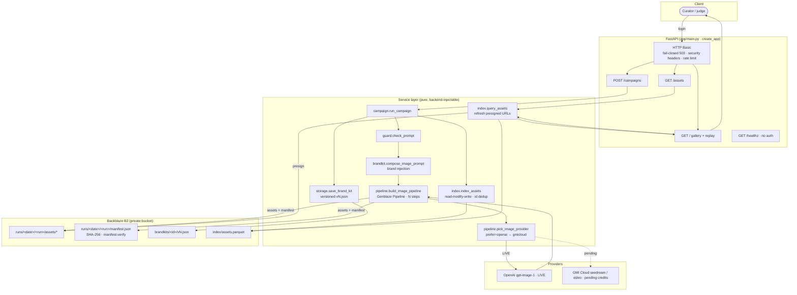

# BrandForge — Architecture

BrandForge turns a reusable **Brand Kit** into coordinated, provenance-tracked media
sets. One Genblaze `Pipeline` runs every variant of a campaign under a single manifest;
**Backblaze B2** is the system of record (assets, manifests, versioned Brand Kits, and a
Parquet catalog); a thin FastAPI layer serves an authenticated gallery with replay.

## Data flow

## Components

- **`app/config.py`** — frozen `Settings` from a gitignored `.env`. B2 keys are **fail-fast**
  (missing → raise at startup); generative providers are optional but at least one is required.
  `has_auth` gates the web layer (both Basic creds must be set, else protected routes 503).
- **`app/models.py`** — `BrandKit` / `Campaign` / `Asset` (+ `Caption`). Ids are constrained
  (`^[A-Za-z0-9_-]+$`, ≤64) so they are safe as B2 key segments; `num_variants` 1–8.
- **`app/guard.py`** — prompt/caption safety: blocks secrets, inflammatory, and spammy content;
  enforces per-platform caption length. A blocked prompt aborts the whole campaign.
- **`app/brandkit.py`** — injects Brand Kit voice/palette/style into each image prompt so a set
  shares one look; also builds the caption brand context.
- **`app/pipeline.py`** — Genblaze orchestration. `pick_image_provider(prefer=…)` resolves a
  provider (OpenAI live; GMI wired), `build_image_pipeline` composes N steps under **one**
  `Pipeline` → **one manifest**, and maps Genblaze results back to our `Asset` schema.
- **`app/storage.py`** — B2 backend (`make_backend`), Brand Kit versioning (`save_brand_kit`),
  presigned delivery URLs (private bucket → signed reads).
- **`app/campaign.py`** — `run_campaign`: save Brand Kit → run pipeline → (optionally) update the
  Parquet index. Fail-fast if `brand.id != campaign.brand_kit_id`; index write is wrapped so a
  catalog failure surfaces as `PipelineError` while assets/manifest remain durable in B2.
- **`app/index.py`** — single Parquet catalog `index/assets.parquet`: `index_assets` (idempotent,
  id-deduped read-modify-write), `query_assets` (filter by brand/campaign/modality, newest first,
  re-signs URLs).
- **`app/main.py`** — `create_app()` factory; backend built once and injected; routes are thin and
  synchronous (blocking B2/OpenAI I/O runs in Starlette's threadpool); responses use `AssetOut`
  (no prompt/provider leakage); `/healthz` is unauthenticated and does not touch B2.
- **`app/security.py`** — HTTP Basic with `secrets.compare_digest`, fail-closed 503 when unconfigured.
- **`genblaze_compat.py`** — patches a Genblaze Windows `file://` URL bug so local provider output
  is transferred to the sink correctly.

## How this maps to the judging axes

| Axis | Where it shows up |
|---|---|
| **① Practical utility** | A curator defines a Brand Kit once and gets a coherent, on-brand image **set** per campaign theme in one call — the real pain for individuals/small brands. |
| **② Production readiness** | Deployed on Render; fail-fast config; HTTP Basic **fail-closed** auth; security headers; rate limiting; presigned (not public) URLs; 83 tests / ~97% coverage; pinned `requirements.lock`; safety guard on prompts. |
| **③ Meaningful B2 + data orchestration** | Not just storage: hierarchical key strategy, **Brand Kit versioning** (`vN.json`), **manifest beside assets** with `manifest.verify()`, a **Parquet catalog** as query layer, and presigned delivery — with **replay** re-signing past sets. |
| **④ Meaningful Genblaze usage** | Single `Pipeline` runs all variants under **one manifest**; **provider abstraction** (OpenAI ↔ GMI via `prefer`); brand injected into every step; image→short-video chain wired for GMI activation. |

## Known trade-offs (honest notes)

- **Captions unwired**: `app/captions.py` is fully implemented and safety-guarded but not called
  from `run_campaign`/web (kept out of the billable deployed path for this submission). Note the
  intentional inconsistency to fix when wiring: `config.has_captions` currently gates on
  `ANTHROPIC_API_KEY`, while the caption code runs on OpenAI (`gpt-5-mini`) — reconcile to OpenAI
  (or make provider-agnostic) at wiring time (Phase 3+).
- **GMI Cloud pending**: provider branch is wired but free credits never arrived, so the deployed
  demo runs on OpenAI. Model ids for GMI are placeholders until confirmed against the live catalog.
- **Index is an unbounded read-modify-write** of a single Parquet file — fine at hackathon scale;
  shard to `index/runs/<run>.parquet` if it grows.
